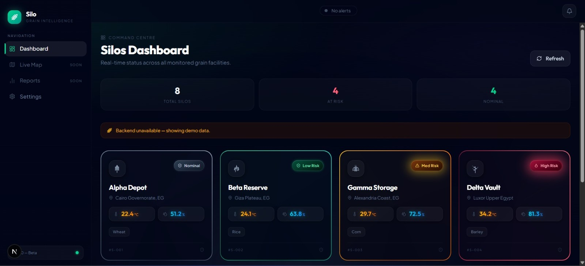
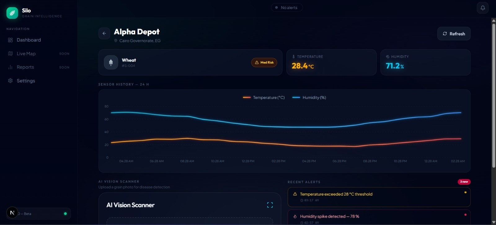
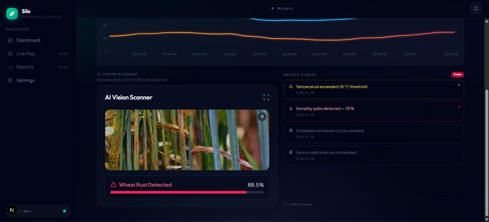

# 🌾 Silo — AI-Powered Crop Health Platform

Silo is a microservices-based platform that uses artificial intelligence to help farmers detect wheat diseases and assess crop health risk in real time.

---

## 🖥️ Screenshots

### Dashboard — Command Centre
Real-time overview of all monitored grain silos with risk levels and sensor readings.



---

### Silo Detail View — Sensor History
Per-silo view showing 24-hour temperature and humidity trends, with live sensor readings and recent alerts.



---

### AI Vision Scanner — Disease Detection
Upload a grain photo directly from the silo detail page. The AI Vision service analyzes it and returns the detected disease with a confidence score.



> **Example result:** Wheat Rust Detected — 88.5% confidence

---

## 📦 Project Structure

```
Silo/
├── ai-vision/                  # Wheat disease detection service (Keras + FastAPI)
│   ├── app/
│   │   ├── main.py             # FastAPI application
│   │   └── final_model.keras   # Trained Keras model (not tracked in git)
│   ├── train.py                # YOLOv8 training script
│   ├── requirements.txt        # Python dependencies
│   └── Dockerfile              # Container definition
│
├── ai-predictive/              # Crop health risk prediction service (XGBoost + FastAPI)
│   ├── app/
│   │   ├── main.py             # FastAPI application
│   │   └── model/
│   │       ├── predict.py      # Inference logic
│   │       └── crop_health_model_lr.pkl  # Trained model (not tracked in git)
│   ├── PREPROCESSCING/
│   │   ├── preprocess.ipynb    # Data preprocessing notebook
│   │   ├── logical_agriculture_data.csv
│   │   └── processed_agriculture_data.csv
│   ├── requirements.txt
│   └── Dockerfile
│
├── backend/                    # Main backend service
├── frontend/                   # Frontend application
├── scripts/                    # Utility scripts
└── docker-compose.yml          # Orchestrates all microservices
```

---

## 🤖 Services Overview

### 1. AI Vision Service (`ai-vision`)
Detects wheat diseases from uploaded images using a Keras deep learning model.

| Property | Details |
|---|---|
| Framework | TensorFlow / Keras |
| Input | Wheat image (JPG/PNG) |
| Output | Disease label + confidence score |
| Port | `8001` |
| Classes | `rust`, `blast`, `mildew`, `healthy` |

### 2. AI Predictive Service (`ai-predictive`)
Predicts crop health risk level based on environmental and soil sensor data.

| Property | Details |
|---|---|
| Framework | Scikit-learn (Logistic Regression Pipeline) |
| Input | Sensor readings (JSON) |
| Output | Risk score + risk level |
| Port | `8002` |
| Classes | `low`, `medium`, `high` |

---

## 🚀 Getting Started

### Prerequisites
- Python 3.11+
- Docker Desktop
- NVIDIA GPU (recommended for training)
- CUDA 12.4+ (for GPU support)

### 1. Clone the Repository
```bash
git clone https://github.com/Ahmed-fall/Silo.git
cd Silo
```

### 2. Add Model Files
Since model files are not tracked in Git, place them manually:

```
ai-vision/app/final_model.keras
ai-predictive/app/model/crop_health_model_lr.pkl
```

### 3. Install Dependencies (without Docker)

**AI Vision:**
```bash
cd ai-vision
pip install -r requirements.txt
```

**AI Predictive:**
```bash
cd ai-predictive
pip install -r requirements.txt
```

---

## ▶️ Running the Services

### Option A — Without Docker (Development)

**AI Vision Service:**
```bash
cd ai-vision
python -m uvicorn app.main:app --reload --port 8001
```

**AI Predictive Service:**
```bash
cd ai-predictive
python -m uvicorn app.main:app --reload --port 8002
```

### Option B — With Docker

**Build and run AI Vision:**
```bash
cd ai-vision
docker build -t ai-vision .
docker run -p 8001:8001 ai-vision
```

**Build and run AI Predictive:**
```bash
cd ai-predictive
docker build -t ai-predictive .
docker run -p 8002:8002 ai-predictive
```

**Run all services together:**
```bash
docker-compose up --build
```

---

## 📡 API Reference

### AI Vision Service — `http://localhost:8001`

#### `GET /health`
Check if the service is running.

**Response:**
```json
{
  "status": "ok",
  "service": "ai-vision"
}
```

#### `POST /analyze`
Upload a wheat image to detect disease.

**Request:** `multipart/form-data`
| Field | Type | Description |
|---|---|---|
| `file` | image | Wheat image (JPG or PNG) |

**Response (success):**
```json
{
  "label": "rust",
  "confidence": 0.9982,
  "status": "ok"
}
```

**Response (model unavailable):**
```json
{
  "status": "unavailable"
}
```

**Example using curl:**
```bash
curl -X POST http://localhost:8001/analyze \
  -F "file=@wheat_image.jpg"
```

---

### AI Predictive Service — `http://localhost:8002`

#### `GET /health`
Check if the service is running.

**Response:**
```json
{
  "status": "ok",
  "service": "ai-predictive"
}
```

#### `POST /predict`
Send sensor readings to get a crop health risk assessment.

**Request:** `application/json`
```json
{
  "temperature": 38.0,
  "humidity": 75.0,
  "soil_moisture": 25.0,
  "ndvi": 0.3,
  "pest_damage": 50.0,
  "crop_stress_indicator": 60.0,
  "soil_ph": 6.5,
  "organic_matter": 2.0
}
```

| Field | Type | Description |
|---|---|---|
| `temperature` | float | Air temperature (°C) |
| `humidity` | float | Relative humidity (%) |
| `soil_moisture` | float | Soil moisture level (%) |
| `ndvi` | float | Vegetation index (0.0 – 1.0) |
| `pest_damage` | float | Pest damage level (0–100) |
| `crop_stress_indicator` | float | Stress indicator (0–100) |
| `soil_ph` | float | Soil pH level (0–14) |
| `organic_matter` | float | Organic matter content (%) |

**Response (success):**
```json
{
  "risk_score": 85.0,
  "risk_level": "high",
  "status": "ok"
}
```

**Response (model unavailable):**
```json
{
  "status": "unavailable"
}
```

**Example using curl:**
```bash
curl -X POST http://localhost:8002/predict \
  -H "Content-Type: application/json" \
  -d '{
    "temperature": 38,
    "humidity": 75,
    "soil_moisture": 25,
    "ndvi": 0.3,
    "pest_damage": 50,
    "crop_stress_indicator": 60,
    "soil_ph": 6.5,
    "organic_matter": 2.0
  }'
```

---

## 🧪 Testing the APIs (Swagger UI)

Both services come with built-in interactive API documentation:

| Service | Swagger URL |
|---|---|
| AI Vision | http://localhost:8001/docs |
| AI Predictive | http://localhost:8002/docs |

Open in your browser, click **"Try it out"** on any endpoint, and test directly.

---

## 🏋️ Training the Model (Optional)

To fine-tune the YOLOv8 model on the wheat disease dataset:

```bash
cd ai-vision
python train.py
```

Requirements:
- Kaggle dataset downloaded to `ai-vision/data/`
- NVIDIA GPU with CUDA support
- ~1-2 hours training time

---

## 🔒 Notes

- Model files (`*.keras`, `*.pkl`, `*.pt`) are **not tracked in Git** due to size
- The `.gitignore` excludes `data/`, `*.keras`, `*.pt`, `*.h5`, `__pycache__/`
- Always activate your virtual environment before running locally

---

## 👥 Team

| Service | Responsibility |
|---|---|
| `ai-vision` | Wheat disease detection |
| `ai-predictive` | Crop health risk prediction |
| `backend` | Main API and business logic |
| `frontend` | User interface |
